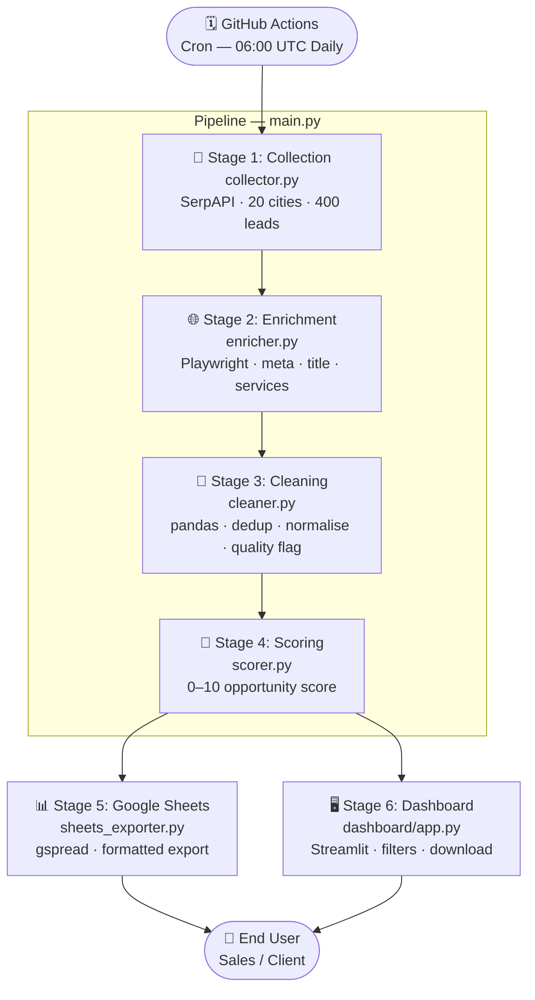
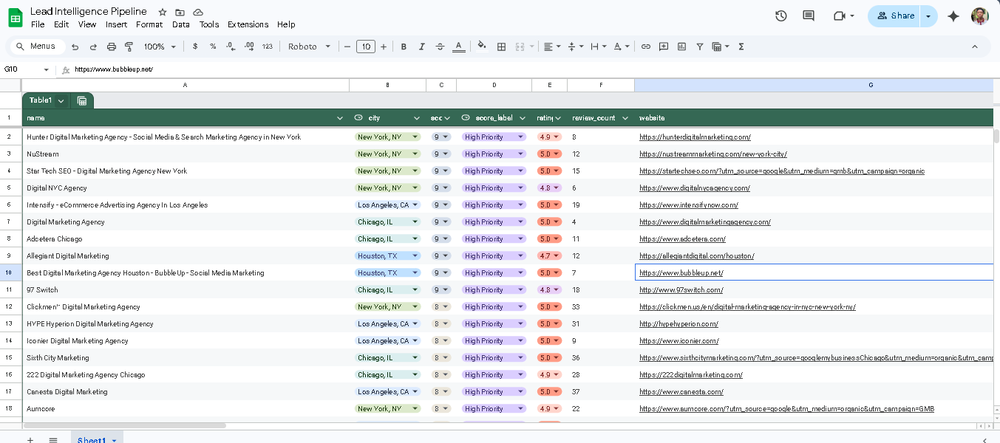
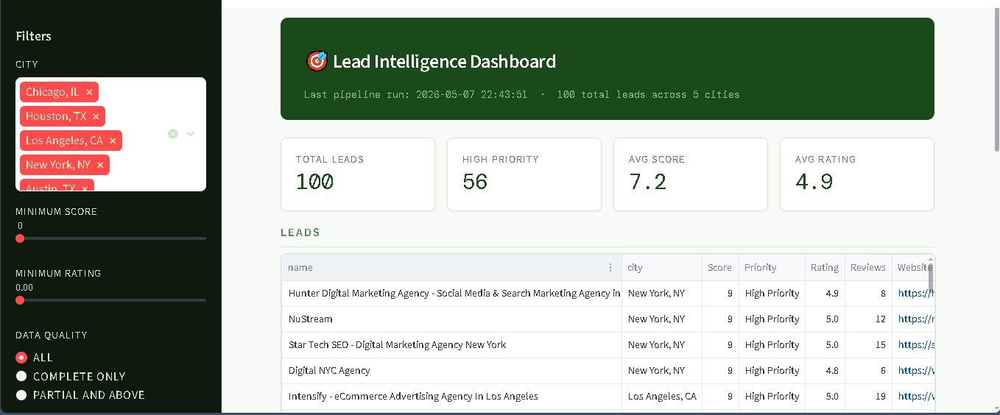

# Lead Intelligence Pipeline


> An automated, end-to-end business lead intelligence system for digital marketing agencies across 20 US cities — collecting, enriching, scoring, and delivering qualified leads to Google Sheets and a filterable dashboard on a daily schedule.

**[Live Dashboard →](https://lead-intelligence-pipeline.streamlit.app)** &nbsp;|&nbsp; **[Google Sheet →](https://docs.google.com/spreadsheets/d/1BPlWFa69VZmS-9t0xH-i0gnACUyMh6ldK5rX1pegbIs/edit?usp=sharing)**

---

## The Business Problem

Finding qualified leads manually is slow, expensive, and inconsistent. A sales team searching Google Maps city by city, copying business details into a spreadsheet, then spending hours visiting websites to assess whether a prospect actually needs marketing help is a full-time job that produces unreliable results. This pipeline automates that entire workflow: it searches 20 US cities for digital marketing agencies, visits every website to extract SEO and content signals, scores each lead on how much they demonstrably need digital marketing services — not just whether they exist — and delivers a prioritised, filterable list to Google Sheets and a live dashboard, refreshed daily without any human involvement. The result is a sales team that starts each day with a ranked list of warm prospects instead of a blank spreadsheet.

---

## Architecture



---

## Scoring Criteria

The scoring model measures **need for digital marketing services**, not business quality. A business with a 5.0 rating and 8 reviews is a better prospect than one with 4.2 and 500 reviews — the first is clearly underserved online.

| Criteria | Points | Rationale |
|---|---|---|
| `review_count` < 50 | +2 | Small online footprint — high growth opportunity |
| `review_count` < 20 | +1 (stacks) | Very low visibility — strong services need |
| `rating` ≥ 4.0 | +2 | Good product worth marketing — bad businesses aren't worth the outreach |
| `rating` ≥ 4.7 | +1 (stacks) | Exceptional reputation being undersold online |
| `meta_description` missing or < 50 chars | +2 | Clear SEO gap — immediate, concrete service need |
| `services_snippet` missing or empty | +1 | No structured content — content strategy opportunity |
| `page_title` present and > 30 chars | +1 | Site is indexable and active — lead is reachable |
| **Maximum** | **10** | |

**Priority labels:**

| Score | Label |
|---|---|
| 8 – 10 | 🟢 High Priority |
| 5 – 7 | 🟡 Medium Priority |
| 0 – 4 | 🔴 Low Priority |

---

## Tech Stack

| Component | Technology | Purpose |
|---|---|---|
| Data Collection | SerpAPI (Google Maps engine) | Business listings across 20 US cities |
| Website Enrichment | Playwright (async, headless Chromium) | Meta description, page title, services content |
| Cleaning | pandas | Deduplication, normalisation, quality flagging |
| Scoring | Custom Python function | Opportunity-based lead scoring |
| Export | gspread + gspread-formatting | Google Sheets with conditional formatting |
| Scheduling | GitHub Actions (cron) | Reliable daily automation |
| Dashboard | Streamlit | Filterable UI with CSV download |
| Logging | Python logging module | Unified log across all stages |

---

## Setup Instructions

### Prerequisites

- Python 3.12+
- A SerpAPI account (free tier: 100 searches/month — [serpapi.com](https://serpapi.com))
- A Google Cloud account (free — [console.cloud.google.com](https://console.cloud.google.com))
- A GitHub account (for scheduled automation)

---

### 1. Clone and install

```bash
git clone https://github.com/your-username/lead-intelligence-pipeline.git
cd lead-intelligence-pipeline

python -m venv .venv

# Windows PowerShell
.venv\Scripts\Activate.ps1

# macOS / Linux
source .venv/bin/activate

pip install -r requirements.txt
playwright install chromium
```

---

### 2. Get your SerpAPI key

1. Sign up at [serpapi.com](https://serpapi.com) and go to your dashboard
2. Copy the API key from the top of the page

---

### 3. Set up Google Service Account

This allows the pipeline to write to Google Sheets without user interaction.

1. Go to [console.cloud.google.com](https://console.cloud.google.com) and create a new project
2. In the search bar, find and enable **Google Sheets API**
3. Find and enable **Google Drive API**
4. Go to **IAM & Admin → Service Accounts → Create Service Account**
5. Name it anything (e.g. `lead-intel`), skip optional fields
6. On the service account detail page → **Keys** tab → **Add Key → JSON**
7. Download the file and rename it `credentials.json`
8. Place `credentials.json` in the project root — **never commit this file**

---

### 4. Create the Google Sheet

1. Go to [drive.google.com](https://drive.google.com) and create a new Google Sheet
2. Name it exactly: `Lead Intelligence Pipeline`
3. Click **Share** → paste the `client_email` from your `credentials.json` → set role to **Editor**

---

### 5. Configure environment variables

Create a `.env` file in the project root:

```env
SERPAPI_KEY=your_serpapi_key_here
GOOGLE_SHEET_NAME=Lead Intelligence Pipeline
GOOGLE_CREDENTIALS_PATH=credentials.json
```

---

### 6. Run the pipeline

```bash
python main.py
```

Expected runtime: 8–15 minutes for 20 cities (dominated by Playwright enrichment).

Expected output:
```
Pipeline run started
Stage 1/5 — Collection complete: 400 leads
Stage 2/5 — Enrichment complete: 280 successful
Stage 3/5 — Cleaning complete: 398 rows
Stage 4/5 — Scoring complete: 398 rows
Stage 5/5 — Export complete: https://docs.google.com/spreadsheets/d/...
Pipeline run complete in 612.3s — all stages succeeded
```

---

### 7. Launch the dashboard

```bash
streamlit run dashboard/app.py
```

Opens at `http://localhost:8501`.

---

### 8. Set up GitHub Actions for daily automation

1. Push the repo to GitHub
2. Go to **Settings → Secrets and variables → Actions → New repository secret**

Add three secrets:

| Secret Name | Value |
|---|---|
| `SERPAPI_KEY` | Your SerpAPI key |
| `GOOGLE_SHEET_NAME` | `Lead Intelligence Pipeline` |
| `GOOGLE_CREDENTIALS_JSON` | The full contents of `credentials.json` (copy and paste the entire JSON) |

The workflow at `.github/workflows/pipeline.yml` runs automatically at 06:00 UTC daily. You can also trigger it manually from the **Actions** tab using **Run workflow**.

---

## Project Structure

```
lead-intelligence-pipeline/
├── main.py                  # Orchestrator — runs all stages in sequence
├── collector.py             # SerpAPI collection — 20 cities, 400 leads
├── enricher.py              # Playwright enrichment — meta, title, services
├── cleaner.py               # pandas cleaning — dedup, normalise, quality flag
├── scorer.py                # Lead scoring — 0-10 opportunity score
├── sheets_exporter.py       # Google Sheets export with formatting
├── dashboard/
│   └── app.py               # Streamlit dashboard
├── data/
│   ├── raw/                 # SerpAPI and enrichment output
│   ├── cleaned/             # Cleaned, normalised data
│   └── scored/              # Final scored leads
├── logs/
│   └── pipeline.log         # Unified log across all stages
├── .github/
│   └── workflows/
│       └── pipeline.yml     # GitHub Actions daily cron
├── requirements.txt
├── .env                     # API keys — never commit
├── .gitignore
└── README.md
```

---

## Production Considerations

### Proxy rotation for scraping at scale

The Playwright enricher visits websites directly from a single IP. At 400 URLs per run this works well. At 2,000+ URLs, bot detection (Cloudflare, Imperva) will block a higher percentage of requests. The fix is a residential proxy pool — [BrightData](https://brightdata.com) and [Oxylabs](https://oxylabs.io) are the two production-grade options. Integration requires passing proxy credentials to Playwright's `browser.new_context(proxy={...})` — a one-function change in `enricher.py`.

### GitHub Actions replaces the schedule library

`scheduler.py` is included for local development but is not the recommended production scheduler. GitHub Actions with a cron trigger is more reliable: the process restarts automatically if it fails, every run is logged as an artifact, and there is no dependency on a long-running process staying alive. The workflow at `.github/workflows/pipeline.yml` handles this — push to GitHub and it runs without any additional infrastructure.

### SerpAPI rate limits and quota management

SerpAPI's free tier allows 100 searches per month. The paid plans start at 5,000 searches. The collector detects quota exhaustion mid-run and exits cleanly, saving whatever data was collected before the limit was hit. At scale (20 cities × 20 results = 400 searches per run), a daily schedule exhausts a free account in a single run. For production, either use a paid SerpAPI plan or reduce `RESULTS_PER_CITY` and run less frequently. The quota error surfaces in logs as `[CRITICAL] SerpAPI monthly quota exhausted` and the pipeline continues with partial data rather than failing entirely.

### CRM integration as a next step

The scored CSV output is the natural input for any CRM. HubSpot, Salesforce, and Pipedrive all expose REST APIs with Python SDKs. The integration point is `main.py` — add a Stage 6 that reads `data/scored/scored_leads.csv` and pushes `High Priority` rows to the CRM as new contacts or deals. Key fields to map: `name → company name`, `phone → phone`, `website → website`, `score → lead score`, `score_label → lifecycle stage`. This is a one-module addition that does not touch any existing pipeline code.

---

## Output Examples

### Google Sheet



### Streamlit Dashboard



---

## License

MIT